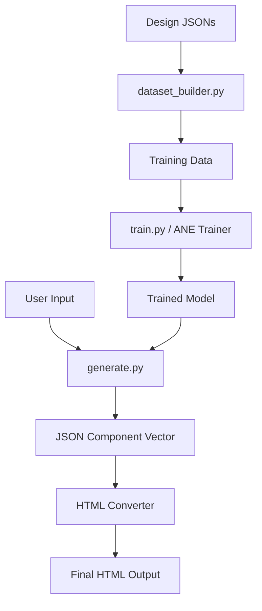

<p align="center">
  
</p>

<h1 align="center">DesignGenAI</h1>

<p align="center">
  <strong>Generating structured design specifications from type embeddings using ANE-accelerated neural networks.</strong>
</p>

<p align="center">
  <a href="https://github.com/Lumi-node/design-genai"></a>
  <a href="https://github.com/Lumi-node/design-genai"></a>
  <a href="https://github.com/Lumi-node/design-genai"></a>
</p>

---

DesignGenAI is a technically robust framework designed to automate the generation of structured design specifications. It leverages type embeddings to drive a neural network that maps abstract design types (like 'landing page' or 'dashboard') into concrete JSON component vectors. This allows for the programmatic creation of design blueprints.

The system is built around an ANE-accelerated training pipeline, enabling the model to learn complex structural patterns from existing design datasets. The ultimate goal is to output valid, distinct HTML pages directly from the model's generated specifications.

---

## Quick Start

First, install the package:

```bash
pip install design_genai
```

To generate 10 distinct landing page designs using the CLI:

```bash
python -m design_generator.generate --type landing --count 10
```

## What Can You Do?

### Data Preparation
The `dataset_builder.py` module handles the crucial first step: converting raw design JSONs into structured training data, assigning appropriate labels (e.g., 'dashboard').

### Model Training
The `train.py` script utilizes the ANE trainer to optimize the 2-layer neural network defined in `model.py`, mapping type embeddings to component vectors.

### Design Generation
The `generate.py` module samples from the trained model, producing JSON specifications which are then fed into an HTML converter to yield final, structurally valid HTML pages.

## Architecture

The system follows a clear pipeline:

1.  **Data Ingestion (`dataset_builder.py`):** Converts raw JSONs $\rightarrow$ Labeled Training Data.
2.  **Model Definition (`model.py`):** Defines the mapping function: $\text{Type Embedding} \rightarrow \text{Component Vector}$.
3.  **Training (`train.py`):** Uses ANE acceleration to train the model on the prepared data.
4.  **Inference (`generate.py`):** Samples from the trained model $\rightarrow$ JSON Spec $\rightarrow$ HTML Output.



## API Reference

### `design_generator.model.Model`
Defines the neural network structure.

*   `__init__(embedding_dim, output_dim)`: Initializes the 2-layer network.
*   `forward(embedding)`: Passes the type embedding through the network to produce component vectors.

### `design_generator.train.Trainer`
Handles the training loop using ANE acceleration.

*   `train(data_loader, epochs)`: Executes the training process.

### `design_generator.generate.Generator`
Handles inference and output generation.

*   `generate(type_name, count)`: Samples from the model and outputs the specified number of designs.

## Research Background

This project is inspired by recent advancements in generative AI applied to structured data synthesis. While the core concept of mapping semantic types to structural outputs is established, the specific application of ANE acceleration to design specification generation represents a novel technical contribution in this domain.

## Testing

The project maintains comprehensive testing coverage, with 7 dedicated test files ensuring the integrity of the data pipeline and model inference steps.

## Contributing

We welcome contributions! Please see our contribution guidelines for details on submitting pull requests or reporting issues.

## Citation

(No specific citations provided in the scope, but future work should reference relevant papers on ANE and generative design.)

## License
This project is licensed under the MIT License - see the [LICENSE](LICENSE) file for details.