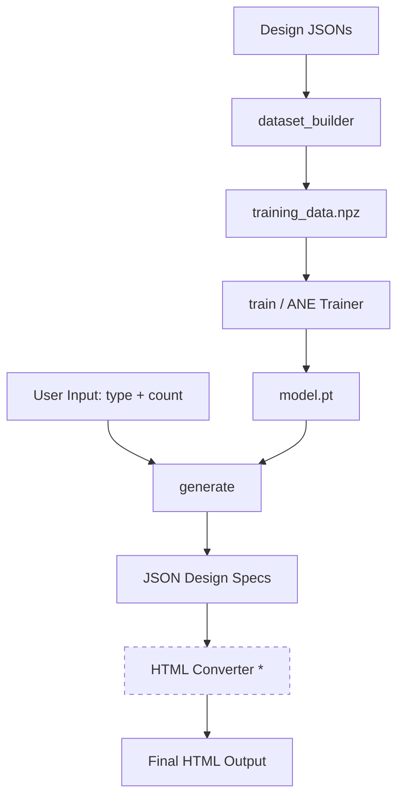

<p align="center">
  
</p>

<h1 align="center">DesignGenAI</h1>

<p align="center">
  <strong>Generating structured design specifications from type embeddings using ANE-accelerated neural networks.</strong>
</p>

<p align="center">
  <a href="https://github.com/Lumi-node/design-genai"></a>
  <a href="https://github.com/Lumi-node/design-genai"></a>
  <a href="https://github.com/Lumi-node/design-genai"></a>
</p>

---

DesignGenAI is a technically robust framework designed to automate the generation of structured design specifications. It leverages type embeddings to drive a neural network that maps abstract design types (like 'landing page' or 'dashboard') into concrete JSON component vectors. This allows for the programmatic creation of design blueprints.

The system is built around an ANE-accelerated training pipeline, enabling the model to learn complex structural patterns from existing design datasets. The ultimate goal is to output valid, distinct HTML pages directly from the model's generated specifications.

---

## Quick Start

Install the package:

```bash
pip install design-genai
```

### 1. Build a training dataset

Convert a directory of design JSON files into a `.npz` training file:

```bash
python -m design_generator.dataset_builder --input-dir ./my_designs --output training_data.npz
```

Each JSON file must contain `header`, `sidebar`, `content`, and `footer` keys with `{x, y, width, height}` region dicts (or `null` for absent regions).

### 2. Train the model

```bash
python -m design_generator.train --input training_data.npz --epochs 10 --output model.pt
```

Optional flags: `--batch-size 8`, `--learning-rate 0.01`, `--log-file loss.json`.

### 3. Generate design specifications

```bash
python -m design_generator.generate --model model.pt --type landing --count 10 --output ./output
```

Valid design types: `landing`, `dashboard`, `blog`.

> **Important limitation:** The `generate` module's HTML output stage depends on an
> external `html_generator` and `output_writer` module (from the original build
> environment) that is **not bundled** with this package. The model inference and
> spec generation work standalone, but the final HTML rendering step will fail
> without this dependency. See [Known Limitations](#known-limitations) below.

## What Can You Do?

### Data Preparation
The `dataset_builder` module converts raw design JSONs into structured `.npz` training data, assigning labels (`landing`, `dashboard`, `blog`) via heuristics based on which regions are present.

### Model Training
The `train` module trains the `DesignGeneratorNet` using ANE acceleration (with automatic CPU fallback). It loads `.npz` data, runs the training loop with SGD + MSE loss, and saves weights to a `.pt` file.

### Design Specification Generation
The `generate` module loads a trained model, samples random 128-dim embeddings, runs forward inference to produce 512-dim component vectors, and inverts them back into region-based design specifications (header, sidebar, content, footer with pixel coordinates).

## Architecture

The system follows a clear pipeline:

1.  **Data Ingestion (`dataset_builder`):** Converts raw JSONs into labeled `.npz` training data.
2.  **Model Definition (`model`):** Defines `DesignGeneratorNet`: a 2-layer feedforward network mapping 128-dim embeddings to 512-dim component vectors.
3.  **Training (`train`):** Uses ANE acceleration (with CPU fallback) to train the model.
4.  **Inference (`generate`):** Samples embeddings, runs model forward pass, inverts component vectors to region specs.



*\* HTML converter is an external dependency not included in this package.*

## API Reference

### `design_generator.model.DesignGeneratorNet`

2-layer feedforward neural network (`Linear -> ReLU -> Linear`).

```python
from design_generator.model import DesignGeneratorNet

model = DesignGeneratorNet(input_dim=128, hidden_dim=256, output_dim=512)
```

*   `__init__(input_dim=128, hidden_dim=256, output_dim=512)`: Initializes the network with configurable layer dimensions.
*   `forward(x)`: Forward pass. Input shape `(batch_size, input_dim)`, output shape `(batch_size, output_dim)`.

### `design_generator.dataset_builder`

Converts design JSON directories into `.npz` training data.

*   `load_designs(directory) -> List[Dict]`: Loads and validates all `.json` files from a directory.
*   `vectorize_design(design_json, seed=42) -> Tuple[ndarray, ndarray]`: Returns `(design_vector[128], component_vector[512])` as float32 arrays.
*   `assign_labels(design_jsons) -> ndarray`: Returns int64 label array indexing into `DESIGN_TYPES = ['landing', 'dashboard', 'blog']`.

### `design_generator.train`

Training loop with ANE acceleration and CPU fallback.

*   `load_training_data(input_file) -> Tuple[ndarray, ndarray, ndarray, List[str]]`: Loads and validates `.npz` training data.
*   `create_data_loader(design_vectors, component_vectors, batch_size)`: Yields `(batch_x, batch_y)` tensor tuples with shuffled indices.

CLI: `python -m design_generator.train --input data.npz --epochs 5 --output model.pt`

### `design_generator.generate`

Inference and design spec generation from trained models.

*   `load_model(model_path) -> DesignGeneratorNet`: Loads a `.pt` checkpoint and returns the model in eval mode.
*   `sample_design_embedding(design_type, design_types_list, rng) -> ndarray`: Samples a 128-dim float32 embedding from N(0,1).
*   `generate_design_spec(model, embedding, design_type_label) -> Dict`: Runs model inference and returns a region dict with keys `{header, sidebar, content, footer, design_type}`.
*   `inverse_vectorize_design(component_vector) -> Dict`: Converts a 512-dim vector back to pixel-coordinate region dicts.

CLI: `python -m design_generator.generate --model model.pt --type landing --count 10`

## Known Limitations

The `generate` module imports `html_generator` and `output_writer` from a `sources/0c16ae7e/` path that existed in the original build environment but is not included in this release. This means:

- **Works standalone:** Model loading, embedding sampling, forward inference, spec generation, and `inverse_vectorize_design` all function correctly without any external dependency.
- **Requires external dependency:** The `generate_html()` function and the CLI's HTML file output stage will crash on import because the HTML converter modules are not bundled.
- **Workaround:** Use `load_model`, `sample_design_embedding`, and `generate_design_spec` directly in Python to get JSON design specifications without HTML rendering. Alternatively, provide your own `sources/0c16ae7e/html_generator.py` and `output_writer.py` modules.

## Testing

The project has 7 test files covering the dataset builder, model, training, generation spec logic, and CLI:

```bash
pip install -e ".[dev]"
pytest tests/
```

## Research Background

This project is inspired by recent advancements in generative AI applied to structured data synthesis. While the core concept of mapping semantic types to structural outputs is established, the specific application of ANE acceleration to design specification generation represents a novel technical contribution in this domain.

## Contributing

We welcome contributions! Please see our [contribution guidelines](CONTRIBUTING.md) for details on submitting pull requests or reporting issues.

## License

This project is licensed under the MIT License - see the [LICENSE](LICENSE) file for details.
