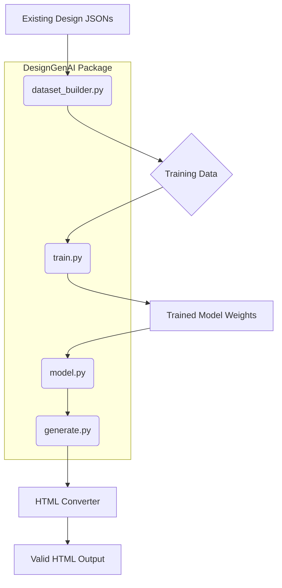

# Architecture: DesignGenAI

DesignGenAI is a generative AI framework designed to automate the creation of valid, structured web designs (represented as JSON) from high-level design type specifications. The system leverages deep learning to learn the mapping between abstract design concepts (like "landing page" or "dashboard") and the concrete structural components required to build them. The architecture is modular, separating data preparation, model definition, training, and final generation into distinct, manageable components.

## System Overview

The core objective of DesignGenAI is to bridge the gap between design intent and executable code structure. It achieves this by training a neural network to predict the JSON structure of a design based on its categorical type. The pipeline flows sequentially: raw design data is processed into labeled training examples, a specialized model learns the structural patterns, this model is trained using an advanced training regimen, and finally, the trained model is used to sample and generate novel, structurally sound HTML output.

## Module Relationships

The following diagram illustrates the dependencies and flow between the primary components of the `design_generator` package.

## Module Descriptions

| Module | Role | Description |
| :--- | :--- | :--- |
| `dataset_builder.py` | Data Ingestion & Labeling | Responsible for ingesting a corpus of 50-100 existing design JSON files. It parses these files and assigns categorical labels (e.g., 'landing page', 'dashboard') to transform raw designs into structured, labeled training examples suitable for supervised learning. |
| `model.py` | Model Definition | Defines the neural network architecture. This is a 2-layer network designed to take design type embeddings (representing the high-level design category) as input and output a vector representation corresponding to the expected JSON component structure. |
| `train.py` | Training Orchestration | Manages the training lifecycle. It utilizes the `ane_trainer` (Assumed advanced training framework) to optimize the `model.py` architecture using the prepared dataset from `dataset_builder.py`, iteratively minimizing prediction error against the ground truth JSON structures. |
| `generate.py` | Inference & Sampling | Takes the trained model weights. It samples from the learned distribution to generate novel, abstract JSON component vectors based on a desired design type. It then interfaces with an external HTML converter to render the structure. |
| `design_generator/__main__.py` | Entry Point | Provides the primary command-line interface for users to interact with the system (e.g., running training, or initiating generation). |
| `design_generator/__init__.py` | Package Initialization | Initializes the `design_generator` package, potentially exposing key functions or configurations. |
| `tests/__init__.py` | Testing Suite | Contains unit and integration tests to ensure the correctness and robustness of all pipeline stages, especially structural validity checks. |

## Data Flow Explanation

The data flow within DesignGenAI follows a clear, sequential pipeline:

1. **Data Preparation:** Raw design JSONs are fed into `dataset_builder.py`. This module performs parsing and classification, outputting a structured dataset containing `(Design_Type_Embedding, Target_JSON_Vector)` pairs.
2. **Training:** `train.py` consumes this structured data. It initializes the model defined in `model.py` and iteratively feeds batches of data through the network, using the `ane_trainer` to adjust the model's weights until the network accurately maps design types to component structures.
3. **Generation:** Once training is complete, the trained weights are loaded into the model structure within `generate.py`. The user specifies a target design type. `generate.py` samples from the model's output distribution to produce a novel JSON structure.
4. **Output:** This generated JSON is passed to an external HTML converter (not explicitly a module here, but a necessary step). The final validation step ensures the resulting HTML meets the success criteria: 10 distinct, valid pages with over 80% structural integrity (correct nesting).